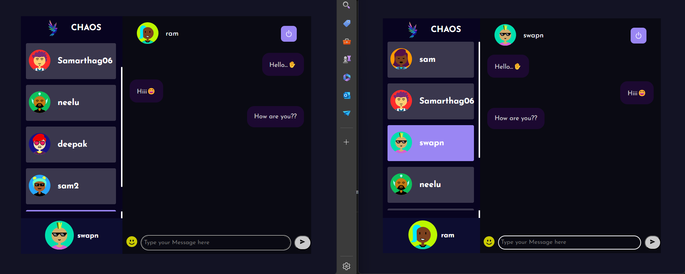

# Chaos

Chaos is a real-time chat application that allows users to communicate with each other using Socket.IO. Users can send text messages along with emoticons, and set avatars for their profiles. The application is built using the MERN stack, with additional features provided by bcrypt for secure password hashing and the Multiavatar API for avatar customization.

## Features

- **Real-Time Messaging:** Users can send and receive messages in real time using Socket.IO.
- **Emoticons:** Users can enhance their messages with a variety of emoticons.
- **Avatar Customization:** Users can set custom avatars for their profiles using the Multiavatar API.
- **Secure Authentication:** User passwords are securely hashed using bcrypt.

## Technologies Used

- **Frontend:**
  - React
  - styled-components
  - Axios

- **Backend:**
  - Node.js
  - Express

- **Database:**
  - MongoDB

- **Authentication:**
  - bcrypt.js

- **Real-Time Communication:**
  - Socket.IO

- **Avatar Customization:**
  - Multiavatar API

## Installation

1. Clone the repository:
    ```bash
    git clone https://github.com/samarthag06/Real-time-chat.git
    ```

2. Navigate to the project directory:
    ```bash
    cd Chaos
    ```

3. Install server dependencies:
    ```bash
    cd server
    npm install
    ```

4. Install client dependencies:
    ```bash
    cd public
    npm install
    ```

## Running the Application

1. Start the backend server:
    ```bash
    cd server
    npm start
    ```

2. Start the frontend server:
    ```bash
    cd public
    npm start
    ```

3. Open your browser and navigate to `http://localhost:3000` to see the application.

## Screenshots

### Login Page


### Avatar selection


### Dashboard

